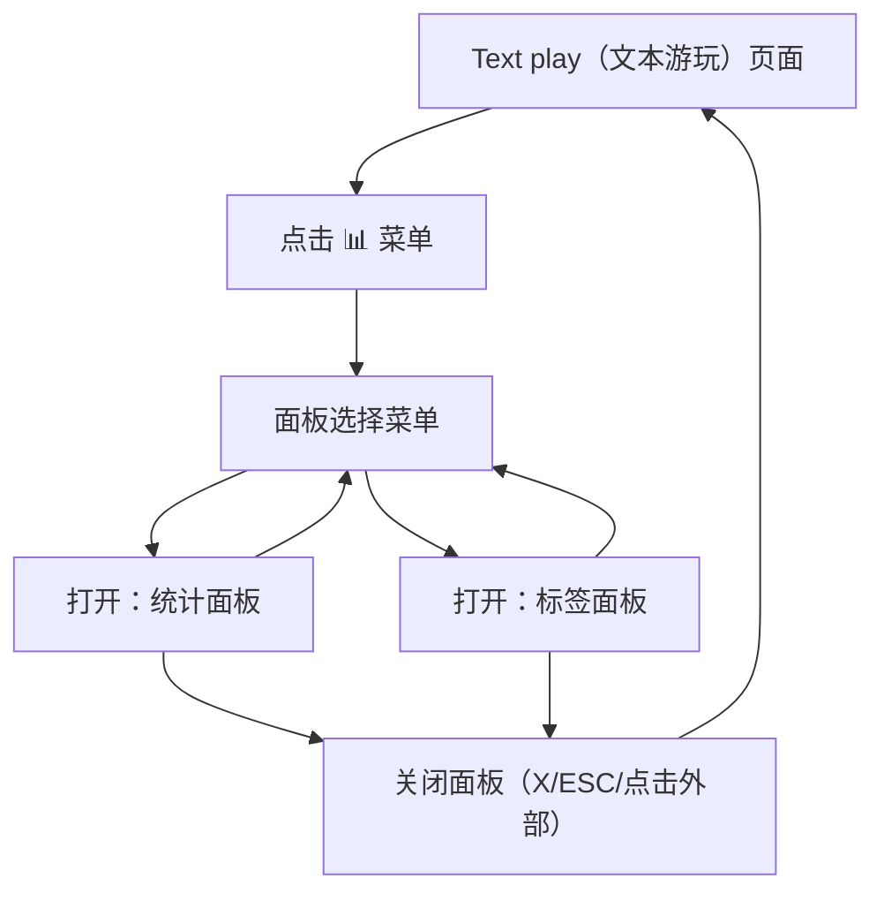

## 1. Product Overview
对“Text play（文本游玩）”页面进行一次 UI/交互重构：所有浮动面板仅通过“📊 菜单”打开（不再悬停触发），并统一统计/标签面板规格与信息呈现。
目标是降低误触、提升可发现性与一致性。

## 2. Core Features

### 2.1 User Roles
本次为纯前端 UI 重构，不新增角色区分。

### 2.2 Feature Module
本次改造涉及以下页面：
1. **Text play（文本游玩）页面**：📊 菜单触发浮动面板（无 hover）、统计面板、标签面板、面板布局与一致性。

### 2.3 Page Details
| Page Name | Module Name | Feature description |
|-----------|-------------|---------------------|
| Text play（文本游玩）页面 | 顶部工具条 | 展示页面标题/关键信息；提供“📊 菜单”入口用于打开/切换浮动面板（仅点击触发，不支持悬停打开）。 |
| Text play（文本游玩）页面 | 📊 菜单（Panel Switcher） | 点击展开菜单；列出可打开的面板项（统计、标签）；点击某项打开对应面板；再次点击同项关闭；菜单外点击关闭菜单。 |
| Text play（文本游玩）页面 | 浮动面板容器（Panels） | 以浮动面板形式呈现；支持与主内容并存；保持统一尺寸/边距/阴影层级；支持 ESC 关闭当前面板；在不同面板间切换保持位置与尺寸一致。 |
| Text play（文本游玩）页面 | 统计面板（Stats Panel） | 与标签面板等宽等高（同一默认规格）；直接展示全部统计条目（移除“more/更多”入口与折叠逻辑）；支持滚动以容纳溢出内容。 |
| Text play（文本游玩）页面 | 标签面板（Tags Panel） | 与统计面板等宽等高（同一默认规格）；展示标签列表/分组（如存在）；支持滚动以容纳溢出内容。 |
| Text play（文本游玩）页面 | 交互与无障碍 | “📊 菜单”与面板支持键盘操作（Tab/Enter/Esc）；面板打开时为可聚焦区域；提供明确的关闭按钮与可读标题。 |

## 3. Core Process
### 用户主流程（Text play）
1. 你进入 Text play 页面进行文本游玩。
2. 你点击顶部工具条的“📊 菜单”按钮打开面板选择菜单。
3. 你点击“统计”或“标签”来打开对应浮动面板；再次点击同一项可关闭。
4. 你在面板中查看信息（统计条目全部可见，无“更多”）；内容过多时在面板内部滚动。
5. 你可点击面板右上角关闭按钮、按 ESC、或点击空白处关闭面板/菜单。

