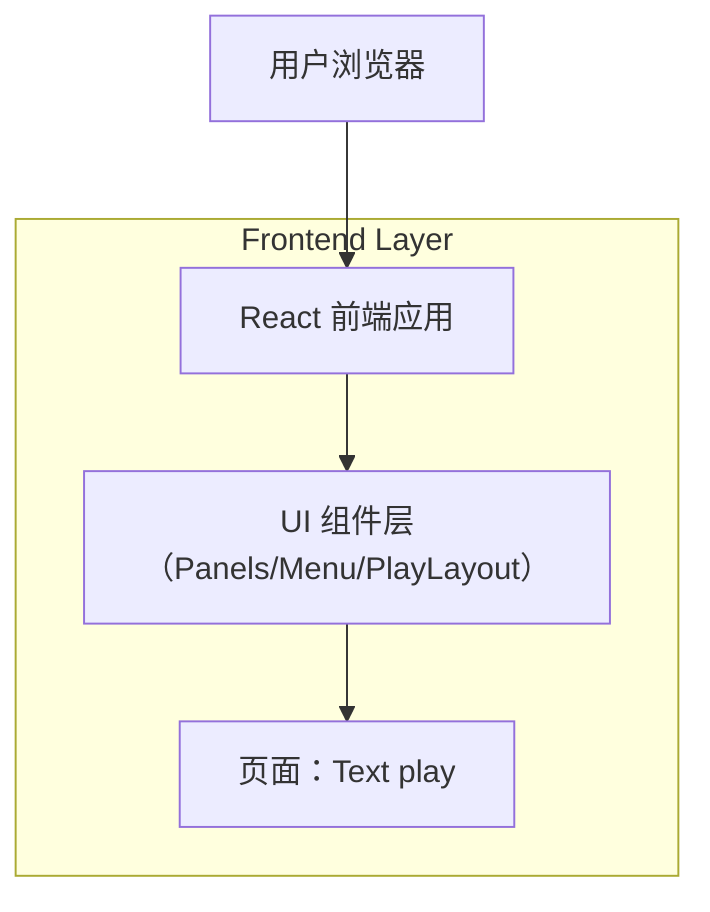

## 1.Architecture design
本次为前端 UI 重构与组件/目录重组，不引入新增后端。



## 2.Technology Description
- Frontend: React@18 + TypeScript + 路由库（如 react-router）+ CSS 方案（如 Tailwind 或 CSS Modules）
- Backend: None（本次不涉及）

## 3.Route definitions
| Route | Purpose |
|-------|---------|
| /play/text | Text play 页面入口（包含主内容与 📊 菜单触发的浮动面板） |

## 4.API definitions (If it includes backend services)
本次不涉及后端 API。

## 5.Server architecture diagram (If it includes backend services)
本次不涉及。

## 6.Data model(if applicable)
本次不涉及。

---

# 前端目录架构提案（用于本次重构）
目标：让“页面（Page）—布局（Layout）—面板（Panels）—通用组件（Components）—样式（Styles）”职责清晰，面板能力可复用到未来其他 play 页面。

## 1) 推荐目录结构（示例）
> 以“按功能/路由分层 + 通用组件沉淀”为原则。

```
src/
  app/
    routes/
      index.tsx              # 路由聚合
    providers/
      AppProviders.tsx       # 全局 Provider（主题/路由/状态等）

  pages/
    play/
      text/
        TextPlayPage.tsx     # 页面容器：拼装布局与业务模块
        TextPlayPage.styles.(css|ts)
        components/
          PlayTopBar.tsx     # 顶部工具条（含 📊 菜单入口）
          PlayContent.tsx    # 主内容区域（文本游玩主体）
        panels/
          PanelsHost.tsx     # 浮动面板宿主：定位/层级/关闭逻辑
          StatsPanel.tsx     # 统计面板（移除“more”）
          TagsPanel.tsx      # 标签面板
          panelTypes.ts      # 面板枚举/类型
          panelLayout.ts     # 面板尺寸/定位配置（统一规格）
        hooks/
          usePanels.ts       # 面板开关状态、ESC 关闭、外部点击关闭
        tests/
          textPlayPanels.spec.ts

  features/
    playPanels/
      PanelMenuButton.tsx    # 📊 菜单按钮（通用）
      PanelSwitcherMenu.tsx  # 面板选择菜单（通用）

  components/
    overlay/
      FloatingPanel.tsx      # 通用浮动面板壳（标题/关闭/滚动区）
      Popover.tsx            # 通用弹出层（仅点击触发，不做 hover）
    primitives/
      IconButton.tsx
      Divider.tsx

  styles/
    tokens.css               # 颜色/间距/圆角/阴影等 tokens
    globals.css

  utils/
    dom/
      focus.ts               # focus trap/回焦工具（如需要）

  types/
    ui.ts
```

## 2) 分层与依赖规则（建议）
- pages/** 只负责“组装”，不实现通用面板壳。
- features/** 放“可跨页面复用、但仍带业务语义”的模块（如 playPanels）。
- components/** 放纯 UI 原子/通用组件（FloatingPanel/Popover/IconButton）。
- panels/ 下只放“某个页面的面板实现”，面板壳统一用 components/overlay/FloatingPanel。

## 3) 关键落点（对齐你的改造点）
- 禁用 hover 打开：Popover/菜单组件只暴露 onClick / onKeyDown 打开能力。
- 统计/标签面板等规格：panelLayout.ts 统一控制 width/height/maxHeight/position。
- 移除 stats "more"：StatsPanel 只做“完整列表 + 内部滚动”。
